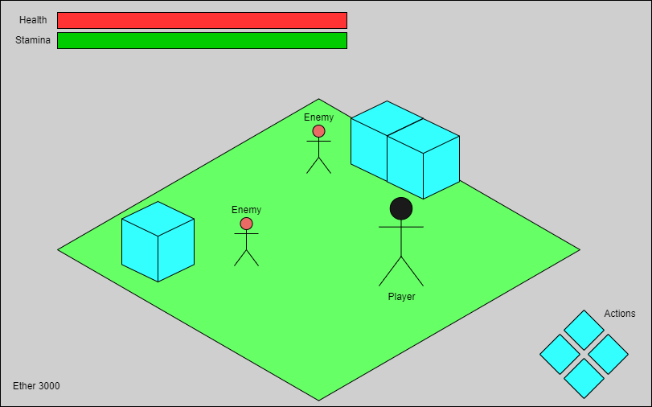

# Game Design Documentation

- Overview
    - Synopsys
        - “The Player is a member of ARC in the year 2464, Fighting to forestall the physical and digital worlds from being merged together by a group calling themselves the Rogues. Wielding advanced technology and techniques likened to magic, The Player must fight their way through this new world.”
    - A Third Person 3D Action-Adventure game
        - Inspired by the likes of NieR Automata and Dark Souls
        - Designed to be a challenging skill-based game
        - Rewards understanding of game mechanics, heavily punishes negligence.

## Game Elements

### Player
- Controlled via player input
    - WASD / Left Joystick Movement
    - Mouse / Right Joystick Camera
#### Attributes
- Level
    - Increases base attributes

    | Short | Attribute | Description |
    | ----- | --------- | ----------- |
    | VIG   | Vigor     | Determines Max Health |
    | INT | Intelligence | Determines Magical Action Potency|
    | FCS | Focus | Determines Magical Action Critical Chance |
    | STR | Strength | Determines Physical Action Potency | 
    | DET | Determination | Determines Physical Action Critical Chance |
    | ATT | Attunement | Determines Ether absorbtion rate and Action recast speed |

    
- Health
    - When depleted, the player will die.
- Stamina
    - Depletes on the execution of certain actions
- Ether
    - Experience Points & Currency rolled into one. 
    - Dropped by enemies upon defeat
#### Actions
- Performable by the player
    - TOP: 1 / Left Shoulder Button
    - RIGHT: 2 / Right Shoulder Button
    - LEFT: Left Mouse Button / Left Face button
    - BOTTOM: Right Mouse Button / Bottom Face button
    //This control scheme absolutely needs changing.
- Actions have 'recast' times
    - Unique to each action
        - e.g. "Attack" may have a 0.6s recast, whereas "Pneuma" could have a 15s recast.
- Some Actions may deplete other resources
    - e.g. the healing action "Aetherpool" drains 15% of the player's current Ether, and additionally has a 30s recast
### Enemies
- AI controlled pawns similar to the player
    - Enemies also have actions
        - Select which to execute based on weights
        - Executes actions, with speed based on their ATT (Attunement) stat. 
### Action List

### Required Subsystems
- 3D Rendering +
    - Camera +
    - Lights -
    - Shadows -
    - Animations +
- UI +
    - Text Rendering +
    - Sprite Rendering +
- Physics
    - AABB Collisions +
    - OBB Collisions -
    - Capsule Collisions -
- World Management
    - Entity Spawning / Despawning -
    - Scene Hierarchy -
- AI
    - A* Pathfinding -
- I/O
    - Input +
        - Keyboard +
        - Mouse +
        - Gamepad -
    - Assets +
- Audio - 